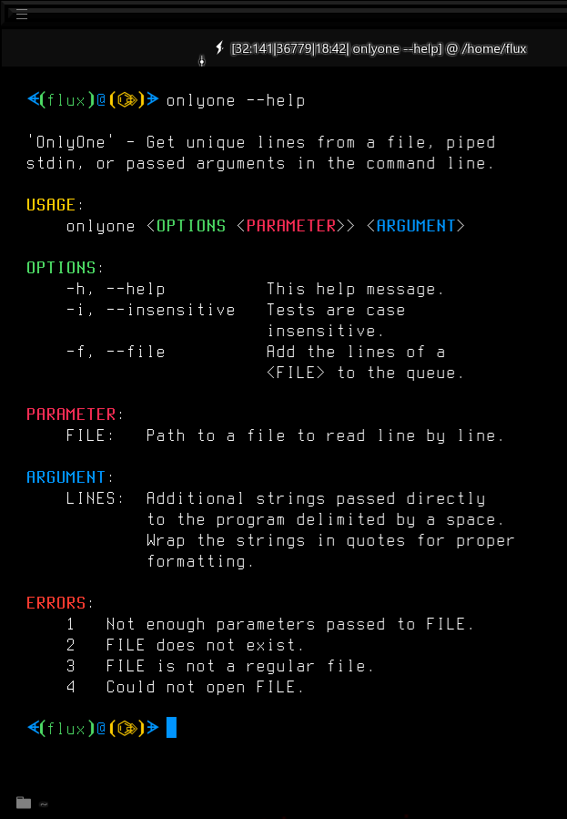
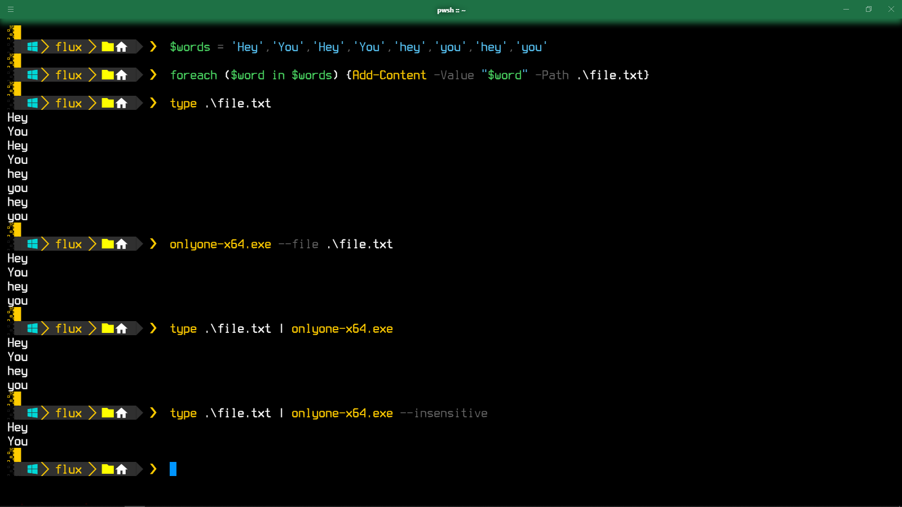

# OnlyOne V2


---

## Description

Get unique lines from a file, piped stdin, or passed arguments in the command line. This is version 2, a complete re-write in a different language.

---

## Table Of Contents

- [OnlyOne V2](#onlyone-v2)
  - [Description](#description)
  - [Table Of Contents](#table-of-contents)
  - [About](#about)
    - [Version 2](#version-2)
      - [Reason For V2](#reason-for-v2)
      - [New In V2](#new-in-v2)
    - [Motivation](#motivation)
  - [Usage](#usage)
    - [Environment](#environment)
    - [Installation](#installation)
      - [Linux, Android, and Mac OS Path](#linux-android-and-mac-os-path)
      - [Windows Path](#windows-path)
      - [Android Installation](#android-installation)
    - [Examples](#examples)
  - [Project Information](#project-information)
    - [File Information](#file-information)
    - [MD5](#md5)
  - [Media](#media)
    - [Logo](#logo)
    - [Help Screen](#help-screen)
    - [Silly Example](#silly-example)
  - [Consider Donating](#consider-donating)
  - [LICENSE](#license)

---

## About

### Version 2

#### Reason For V2

This version, officially **Version 2**, is a ***C++*** re-write of my *RustLang* command line program of the same name. I needed to add a way to process different types of input (stdin from pipe, file, and/or passed args) as the original only accepts lines from a file.

Since I'm far more experienced with *C++* and have just barely learned *Rust* then *C++* is the more viable option for me at this point.

#### New In V2

- Added the ability to accept all manner of standard input rather than only just a file.
  - Input types
    - FILE - any readable file
    - PIPE - output from from another command
    - ARGS - any string passed to the program not attached to a switch (e.g. -f FILE).
  - As the name of the program implies this only prints one unique line from all inputs.
- Created an **Android** *build* and *release*.

### Motivation

- I wanted a better solution than `|sort|uniq` to get unique lines from a file. I use this to truncate files like *.bash_history* (especially since I use `fzf` to search history).
- I like to make my own utilities even if there are viable alternatives.
- I needed to add more features

---

## Usage

### Environment

This is a command line tool that should work in any *shell*/*terminal*/*console*/*tty* in several operating systems.

### Installation

This is a portable application with no dependencies, but the Linux version has a `deb` package installer that provides simple `Bash Completion` and some icons for `hicolor`. If it is not installed it should be placed in your `PATH` in your respective environment. if you don't put in a `PATH` then you will have to run it directly, of course.

Your `PATH`'s can be found in your respective variables per your operating system (of course, you might've added your own directories to the `PATH`:

#### Linux, Android, and Mac OS Path

```Bash
echo $PATH
# or
printf '%s\n' $PATH
```

#### Windows Path

PowerShell

```PowerShell
Write-Host $Env:PATH
```

#### Android Installation

Sorry that I don't have this in a PPA, but the best method to install this in **Android** for **Termux** (or other) if you're not rooted is to copy it to `/data/local/tmp/` using `adb` or copy it to your SD card and use *Termux* to copy it to where from where ever you can.

If you're rooted you can do whatever you like, same Linux method (no deb).

CMD

```CMD
echo %PATH%
```

### Examples

Various simple examples that work in all operating systems provided.

Windows Examples

PowerShell:

```PowerShell
$lines =
  "Line A",
  "Line A",
  "Line B",
  "Line B",
  " Line C",
  "Line C",
  "line c",
  "LINE C"
# Not in path
$lines | '.\Path\To\onlyone.exe'
Line A
Line B
 Line C
Line C
line c
LINE C
# In path
$line | onlyone --insensitive
Line A
Line B
 Line C
Line C

```

<!-- 'C:\Path\To\onlyone.exe'  -->

Everything Else Examples

```Bash
# Not in path
cat ~/.bash_history | wc -l
2245
/path/to/onlyone --file ~/.bash_history | wc -l
1333

# In path
# Reduce line length of .bash_history and backup.
onlyone -f ~/.bash_history >> ~/.bash_history.unique &&
cp ~/.bash_history ~/.bash_history.backup &&
mv ~/.bash_history.unique ~/.bash_history
```

Help Screen

```Bash
                                                  
 'OnlyOne' - Get unique lines from a file, piped  
 stdin, or passed arguments in the command line.  
                                                  
 USAGE:                                           
     onlyone <OPTIONS <PARAMETER>> <ARGUMENT>     
                                                  
 OPTIONS:                                         
     -h, --help          This help message.       
     -i, --insensitive   Tests are case           
                         insensitive.             
     -f, --file          Add the lines of a       
                         <FILE> to the queue.     
                                                  
 PARAMETER:                                       
     FILE:   Path to a file to read line by line. 
                                                  
 ARGUMENT:                                       
     LINES:  Additional strings passed directly   
             to the program delimited by a space. 
             Wrap the strings in quotes for proper
             formatting.                          
                                                  
 ERRORS:                                          
     1   Not enough parameters passed to FILE.
     2   FILE does not exist.                 
     3   FILE is not a regular file.          
     4   Could not open FILE.                 
                                                  
```

<!-- TODO End Usage section -->

---

## Project Information

This project is written in `C++`.

[![C++](https://img.shields.io/endpoint?url=https://raw.githubusercontent.com/Lateralus138/onlyonev2/master/docs/json/cpp.json&logo=data%3Aimage%2Fpng%3Bbase64%2CiVBORw0KGgoAAAANSUhEUgAAABAAAAAQCAMAAAAoLQ9TAAAABGdBTUEAALGPC%2FxhBQAAACBjSFJNAAB6JgAAgIQAAPoAAACA6AAAdTAAAOpgAAA6mAAAF3CculE8AAABcVBMVEUAAAAAgM0Af8wolNQAa7YAbbkAQIcAQIYAVJ0AgM0AgM0AgM0AgM0AgM0AgM0AgM0AgM0AgM0AgM0Af8wAfswAfswAf8wAgM0AgM0AgM0Af80AgM0AgM0AgM0AgM0Af8wAgM0Af80djtIIg84Af8wAfsxYrN4Fg84Gg85RqNwej9MLhM8LhM8AfcsAgM0Hg88AfsshkNNTqd1%2Fv%2BUXi9AHdsAAYKoAY64ih8kAf81YkcEFV54GV55Sj8EnlNULhc8AecYdebwKcrsAe8gAb7oAXacAXqgAcLwAImUAUpoAVJ0AUpwAUZoAIWMAVJ0AVJ0AUpwAUZwAVJ0AVJ0AVJ0AVJ0AgM0cjtJqteGczetqtOEAf807ndjL5fT9%2Fv7%2F%2F%2F%2FM5fQ9ntnu9vu12vCi0Oz%2F%2F%2F6Hw%2Bebzeufz%2Bx%2Bv%2BW12e%2Bgz%2BxqteLu9fmRx%2BjL3Ovu8%2Fi1zeKrzeUAUpw7e7M8fLQAU50cZ6hqm8WcvNgAVJ3xWY3ZAAAAVnRSTlMAAAAAAAAAAAAREApTvrxRCQQ9rfX0qwErleyUKjncOFv%2B%2Fv5b%2Ff7%2B%2Fv7%2B%2Fv1b%2Ff7%2B%2Fv7%2BW%2F7%2B%2Fv79%2Fv7%2B%2Fv7%2B%2Fv7%2B%2Fjfa2jcBKJHqKAEEO6r0CVC8EFaOox4AAAABYktHRF9z0VEtAAAACXBIWXMAAA7DAAAOwwHHb6hkAAAAB3RJTUUH5QYKDQws%2FBWF6QAAAONJREFUGNNjYAABRkZOLkZGBhhgZOTm4eXjF4AJMQoKCYuEhYmKCQmCRBjFJSSlwiMiI6PCpaRlxBkZGGXlomNi4%2BLj4xISo%2BXkgQIKikqx8UnJyUnxKcqKKiAB1ajUJDV1Dc00LW0dXSaggF56fLK%2BgYFhhlGmsQkzRCDL1MzcIhsmYJkTn2tlbWObZ2cP0sKk4OCYH19QWFgQX%2BTkrMLEwOLiWlySD7I2v7TMzZ2Vgc3D08u7vKKysqLc28vHlx3oVg4%2F%2F4DAqqrAAH8%2FDohnODiCgkNCgoM4OOD%2B5eAIDYVyAZ9mMF8DmkLwAAAAJXRFWHRkYXRlOmNyZWF0ZQAyMDIxLTA2LTEwVDE4OjEyOjQ0LTA1OjAwkjvGQgAAACV0RVh0ZGF0ZTptb2RpZnkAMjAyMS0wNi0xMFQxODoxMjo0NC0wNTowMONmfv4AAAAASUVORK5CYII%3D)](http://www.cplusplus.org/)


|Description|Status|
|:---:|:---:|
|Project Release Date||
|Total downloads for this project||
|Complete repository size||
|Commits in last month||
|Commits in last year||

Latest Version Status

|Description|Status|Number of Downloads|
|:---:|:---:|:---:|
|Latest Release version|||
|Latest Tag version, possible Pre-Release's|||

### File Information

All current compiled files and the source of this project can be found at this repository in the **`Releases`** section under **`Stable Release`** and can be found in 32 (*X86*) and 64 (*X64*) bit format for *Windows* and 64 bit otherwise.

You may want to rename any of the provided executables to `onlyone` (or `onlyone.exe`).

***This is the recommended method of download.***

[![CR](https://img.shields.io/endpoint?url=https://raw.githubusercontent.com/Lateralus138/onlyonev2/master/docs/json/current_releases.json&logo=data%3Aimage%2Fpng%3Bbase64%2CiVBORw0KGgoAAAANSUhEUgAAABAAAAAQCAMAAAAoLQ9TAAAABGdBTUEAALGPC%2FxhBQAAACBjSFJNAAB6JgAAgIQAAPoAAACA6AAAdTAAAOpgAAA6mAAAF3CculE8AAABcVBMVEUAAAAAgM0Af8wolNQAa7YAbbkAQIcAQIYAVJ0AgM0AgM0AgM0AgM0AgM0AgM0AgM0AgM0AgM0AgM0Af8wAfswAfswAf8wAgM0AgM0AgM0Af80AgM0AgM0AgM0AgM0Af8wAgM0Af80djtIIg84Af8wAfsxYrN4Fg84Gg85RqNwej9MLhM8LhM8AfcsAgM0Hg88AfsshkNNTqd1%2Fv%2BUXi9AHdsAAYKoAY64ih8kAf81YkcEFV54GV55Sj8EnlNULhc8AecYdebwKcrsAe8gAb7oAXacAXqgAcLwAImUAUpoAVJ0AUpwAUZoAIWMAVJ0AVJ0AUpwAUZwAVJ0AVJ0AVJ0AVJ0AgM0cjtJqteGczetqtOEAf807ndjL5fT9%2Fv7%2F%2F%2F%2FM5fQ9ntnu9vu12vCi0Oz%2F%2F%2F6Hw%2Bebzeufz%2Bx%2Bv%2BW12e%2Bgz%2BxqteLu9fmRx%2BjL3Ovu8%2Fi1zeKrzeUAUpw7e7M8fLQAU50cZ6hqm8WcvNgAVJ3xWY3ZAAAAVnRSTlMAAAAAAAAAAAAREApTvrxRCQQ9rfX0qwErleyUKjncOFv%2B%2Fv5b%2Ff7%2B%2Fv7%2B%2Fv1b%2Ff7%2B%2Fv7%2BW%2F7%2B%2Fv79%2Fv7%2B%2Fv7%2B%2Fv7%2B%2Fjfa2jcBKJHqKAEEO6r0CVC8EFaOox4AAAABYktHRF9z0VEtAAAACXBIWXMAAA7DAAAOwwHHb6hkAAAAB3RJTUUH5QYKDQws%2FBWF6QAAAONJREFUGNNjYAABRkZOLkZGBhhgZOTm4eXjF4AJMQoKCYuEhYmKCQmCRBjFJSSlwiMiI6PCpaRlxBkZGGXlomNi4%2BLj4xISo%2BXkgQIKikqx8UnJyUnxKcqKKiAB1ajUJDV1Dc00LW0dXSaggF56fLK%2BgYFhhlGmsQkzRCDL1MzcIhsmYJkTn2tlbWObZ2cP0sKk4OCYH19QWFgQX%2BTkrMLEwOLiWlySD7I2v7TMzZ2Vgc3D08u7vKKysqLc28vHlx3oVg4%2F%2F4DAqqrAAH8%2FDohnODiCgkNCgoM4OOD%2B5eAIDYVyAZ9mMF8DmkLwAAAAJXRFWHRkYXRlOmNyZWF0ZQAyMDIxLTA2LTEwVDE4OjEyOjQ0LTA1OjAwkjvGQgAAACV0RVh0ZGF0ZTptb2RpZnkAMjAyMS0wNi0xMFQxODoxMjo0NC0wNTowMONmfv4AAAAASUVORK5CYII%3D)](https://github.com/Lateralus138/onlyonev2/releases/tag/2.0.0)

You can, of course, build, fork, and/or download the source of this project as per the [LICENSE](./LICENSE) of this project. If you want me to create a build for a different architecture and don't want to do it yourself then just let me know what you need and I'll look into it.

### MD5

These MD5 values are evaluated immediately after the build.

Windows X86 MD5


Windows X64 MD5


Linux MD5


Debian MD5


Android MD5


MacOs MD5


---

## Media

### Logo

A simple little logo I created in *Glimpse* (new version of GIMP).

This is in the *Windows* executables and is installed with the *hicolor* theme with the *Linux* *.deb* installer.


### Help Screen



### Silly Example



---

## Consider Donating

If you like this project and/or just care to donate you can donate to my *PayPal*:

[](https://paypal.me/ianapride?locale.x=en_US)

---

## [LICENSE](./LICENSE)


>This program is free software: you can redistribute it and/or modify it under the terms of the GNU General Public License as published by the Free Software Foundation, either version 3 of the License, or (at your option) any later version.

>This program is distributed in the hope that it will be useful, but WITHOUT ANY WARRANTY; without even the implied warranty of MERCHANTABILITY or FITNESS FOR A PARTICULAR PURPOSE.  See the GNU General Public License for more details.

>...
